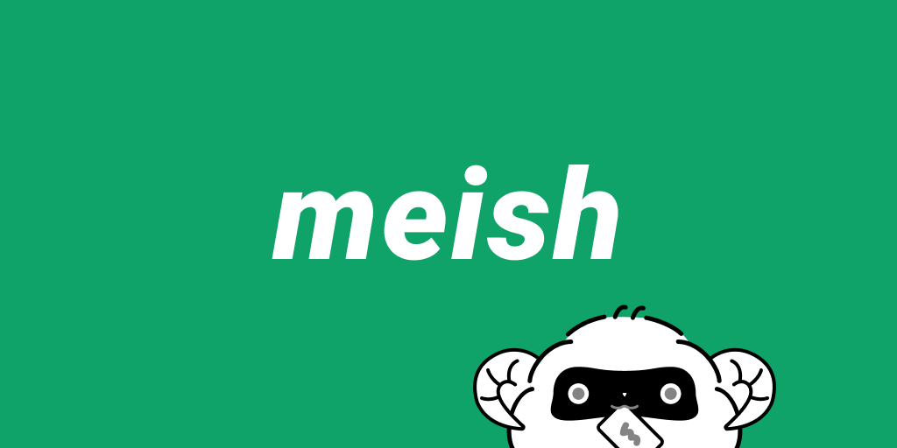

<div align="center">
  <br>
  
  <h1><a href="https://meish.jp">meish</a></h1>
  <strong>Where you share and customize your profile</strong>
</div>
<br>
<p align="center">
  <a href="https://github.com/htktn/meish/actions">
    
  </a>
</p>

# Getting Started

```sh
$ make setup
$ make up

# /frontend
$ yarn start
```

# Contribution

```sh
# enter mysql console
$ make mysql

# enter rails console
$ make web/console
```

# Core Team
- [@tsmrkk](https://github.com/tsmrkk)
- [@yuya-inagaki](https://github.com/yuya-inagaki)
- [@hinako1222](https://github.com/hinako1222)
- [@TaKO8Ki](https://github.com/TaKO8Ki)
